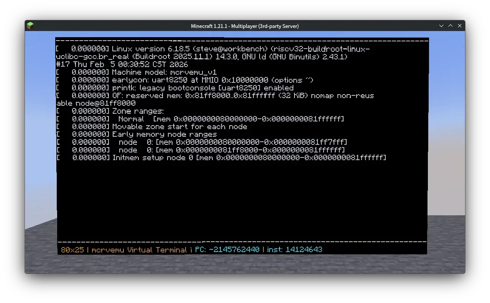

# MCRVEmu

**mcrvemu** is a high-performance RISC-V emulator implemented entirely within Minecraft using vanilla commands (Datapacks). It is capable of booting a **Linux kernel** at an astonishing speed of approximately **16kHz**, pushing the absolute limits of Minecraft's computational capabilities.



## 🚀 Features

- **Architecture**: Full **RV32IMA + Zicsr + Zifencei** support.
- **Performance**: Achieves ~16kHz instruction execution speed.
- **Operating System**: Boots **Linux Kernel 6.12** (no-MMU).
- **Memory System**: 32MB RAM implemented via NBT Storage.
- **I/O**: UART console output rendered directly to Minecraft's chat via `tellraw`.
- **Pure Vanilla**: No mods, no plugins, just standard Minecraft Datapack logic.

## 🛠 Technical Implementation

### Memory Backend
Memory is managed using Minecraft's `storage` system (`rv:data -> ram`). To maintain performance and stay within NBT limits, the emulator uses a **paged storage architecture**:
- **Total RAM**: 32MB.
- **Structure**: 1024 pages (Int Arrays).
- **Page Size**: Each array contains 8,192 integers (32KB per page).

### Instruction Pipeline
The emulator follows a classic CPU pipeline flow handled by `core/step.mcfunction`, executing the fetch-decode-execute-memory-writeback cycle.
- **Decoding**: Handled by `core/decode.mcfunction` with on-demand immediate decoding in `core/imm`.
- **ALU**: Complex arithmetic operations are offloaded to dedicated functions in `src/alu/`.
- **CSR**: Full Control and Status Register implementation for system state management.

## 📂 Project Structure

- `devicetree.dts / .dtb`: Hardware description for the Linux guest.
- `build.py`: The build script to compile the source into a distributable Datapack.
- `src/`: Core logic source files.
    - `inst/`: Individual `.mcfunction` files for every supported instruction (e.g., `addi.mcfunction`).
    - `alu/`: Arithmetic core logic.
    - `core/`: Emulator kernel logic.
        - `decode.mcfunction`: Instruction decoder.
        - `imm/`: Immediate value extraction.
        - `csr/`: CSR register management.
        - `mem/`: The memory backend controller for loads and stores.
        - `utils/`: Helper functions.
        - `step.mcfunction`: The main execution loop.

## 🔨 How to Build

The project requires Python 3 to package the source files into a Datapack.

```bash
python3 build.py <Binary Path> <dist folder>
```

**Example:**
To build a Datapack using a Linux `Image` binary:
```bash
python3 build.py Image dist
```
This will generate the final Datapack in the `dist` folder, which you can then place in your world's `datapacks` directory.

## ⚠️ Requirements

- **Minecraft Version**: 1.21.1 (Pack Format 48).
- **Compatibility**: Higher versions have not been tested but may work.

## 📜 License

This project is licensed under the **MIT License**. Feel free to use, modify, and distribute it.
