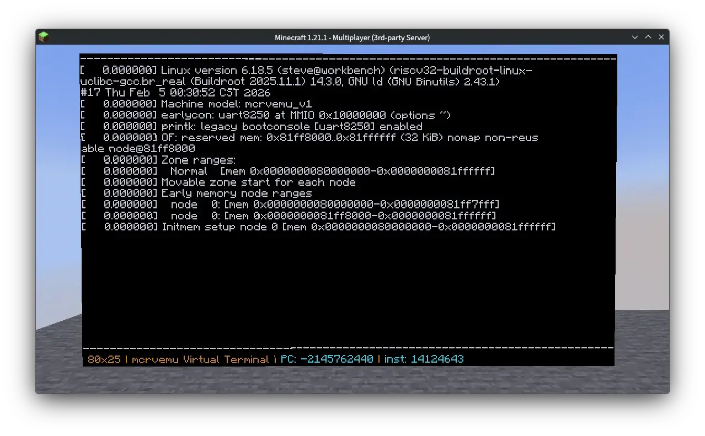

# MCRVEmu

**mcrvemu** is a high-performance RISC-V emulator implemented entirely within Minecraft using vanilla commands (Datapacks). It is capable of booting a **Linux kernel** at an astonishing speed of approximately **16kHz**, pushing the absolute limits of Minecraft's computational capabilities.



## 🚀 Features

- **Architecture**: Full **RV32IMA + Zicsr + Zifencei + Zicboz** support.
- **Performance**: Achieves ~16kHz instruction execution speed.
- **Operating System**: Boots **Linux Kernel 6.12** (no-MMU).
- **Memory System**: 32MB RAM implemented via NBT Storage.
- **I/O**: UART console output rendered directly to Minecraft's chat / Virtual Terminal.
- **State Snapshots**: Rapidly restore a fully booted Linux state generated by a C-based reference emulator.
- **Pure Vanilla**: No mods, no plugins, just standard Minecraft Datapack logic.

## 🔨 How to Build

### 1. Building the Environment (Optional)
If you want to build the Linux system and tools from scratch instead of using prebuilt files, you can use the provided `Makefile`:
- `make buildroot` — Downloads Buildroot and builds the Linux `Image` using the configs in `custom_configs/`.
- `make devicetree.dtb` — Generates the Device Tree Blob (a prebuilt one is already provided).
- `make emu` — Compiles the C reference emulator (`ref_emu`) used for generating snapshots.

*(Alternatively, you can download prebuilt Linux Images and Datapacks from [here](https://drive.google.com/drive/folders/1U63zFaVGW-pl5-5tKFWX1-ChglGWQZ1f?usp=sharing) :)*

### 2. Building the Datapack
The project requires Python 3 to package the source files and the Linux binary into a Datapack.

```bash
python3 build.py <Binary Path> <dist folder>
```

**Example:**
To build a Datapack using your Linux `Image` binary:
```bash
python3 build.py Image dist
```
This will generate the final Datapack in the `dist` folder. Place this folder into your Minecraft world's `datapacks` directory.

## 🎮 Usage in Minecraft

By default, the emulator **does not** start automatically when the datapack is loaded or the world is opened. 

To boot the system from scratch, run the following command in the chat:
```mcfunction
/function rv:core/run
```

To create a virtual terminal, run the following command in the chat:
```mcfunction
/function rv:core/vt/summon
```

To get a full registers dump, run the following command in the chat:
```mcfunction
/function rv:core/dump
```

## 📸 Snapshots (Fast Booting)

Booting Linux from scratch inside Minecraft takes time. To bypass the lengthy boot process, you can use the included C reference emulator (`ref_emu`) to boot the OS externally and take a snapshot of the exact CPU/RAM state at a specific point. 

1. **Compile the reference emulator:**
   ```bash
   make emu
   ```
2. **Generate a Snapshot:**
   Run `./ref_emu` with your image, a target trigger string, and the output path. The emulator will run at native speed until it prints the trigger string, then dump the state into a Minecraft function.
   ```bash
   ./ref_emu Image "/init" src/snapshots/snapshot1.mcfunction
   ```
   *(In this example, the emulator halts and captures the state right after `/init` is printed to the console.)*
3. **Rebuild the Datapack:**
   ```bash
   python3 build.py Image dist
   ```
4. **Restore in Minecraft:**
   Once inside the game, load the snapshot function. The emulator will automatically resume execution from that exact state!
   ```mcfunction
   /function rv:snapshots/snapshot1
   ```

## 🛠 Technical Implementation

### Memory Backend
Memory is managed using Minecraft's `storage` system (`rv:data -> ram`). To maintain performance and stay within NBT limits, the emulator uses a **paged storage architecture**:
- **Total RAM**: 32MB.
- **Structure**: 1024 pages (Int Arrays).
- **Page Size**: Each array contains 8,192 integers (32KB per page).

### Instruction Pipeline
The emulator follows a classic CPU pipeline flow handled by `core/step.mcfunction`, executing the fetch-decode-execute-memory-writeback cycle.
- **Decoding**: Handled by `core/decode.mcfunction` with on-demand immediate decoding in `core/imm/`.
- **ALU**: Complex arithmetic operations are offloaded to dedicated functions in `src/alu/`.
- **CSR**: Full Control and Status Register implementation for system state management.

## 📂 Project Structure

- `Makefile`: Build scripts for Buildroot, DTB, and the reference emulator.
- `build.py`: Datapack compiler script.
- `ref_emu.c` / `mini-rv32ima.h`: Fast C-based reference emulator for snapshot generation.
- `devicetree.dts / .dtb`: Hardware description for the Linux guest.
- `custom_configs/`: Configuration files for `buildroot`, `linux`, `busybox`, `uclibc`, and custom patches.
- `src/`: Core datapack logic source files.
    - `alu/`: Arithmetic core logic.
    - `core/`: Emulator kernel logic.
        - `mem/`: Memory backend controller (loads, stores, MMIO, UART).
        - `csr/`: CSR register management.
        - `imm/`: Immediate value extraction.
        - `vt/`: Virtual Terminal implementation for rendering text output.
        - `utils/`: Helper functions.
        - `step.mcfunction`, `run.mcfunction`, `boot.mcfunction`: Pipeline and execution loops.
    - `inst/`: Individual `.mcfunction` files for every supported instruction (e.g., `addi.mcfunction`).
    - `snapshots/`: Generated fast-boot states.

## ⚠️ Requirements

- **Minecraft Version**: 1.21.1 (Pack Format 48).
- **Compatibility**: Higher versions have not been tested but may work.

## 📜 License

This project is licensed under the **MIT License**. Feel free to use, modify, and distribute it.
